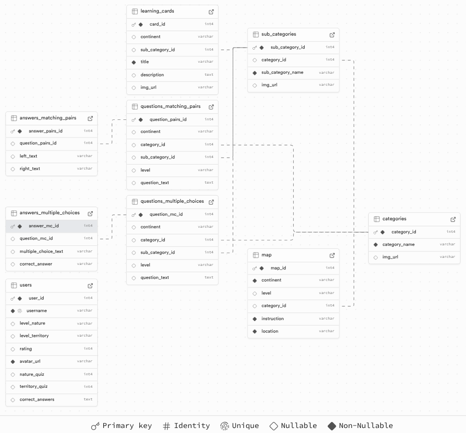

<p align="center"><a href="https://git.io/typing-svg"></a></p>

<div align="center">
  
[](https://github.com/Sofia-Madryha/geo-explorer-be/actions/workflows/test-and-deploy.yml)

</div>

# 🌍 Geo Explorer API

An educational REST API built to support interactive geography learning through learning cards, matching pairs, multiple-choice quizzes, and more.
<br/>

## 🚀 Live Demo

👉 [Access the Live API on Render](https://geo-explorer-be.onrender.com/api)

Use `/api` to view all available endpoints.

<br/>

## 📖 Table of Contents

- [🌍 Geo Explorer API](#-geo-explorer-api)
  - [🚀 Live Demo](#-live-demo)
  - [📖 Table of Contents](#-table-of-contents)
  - [📋 Features](#-features)
  - [🛠️ Tech Stack](#️-tech-stack)
  - [📦 Architecture](#-architecture)
  - [📂 Database Schema](#-database-schema)
  - [✅ Getting Started](#-getting-started)
    - [🔧 Prerequisites](#-prerequisites)
    - [🛠 Installation \& Setup](#-installation--setup)
  - [🧪 Running Tests](#-running-tests)
  - [📖 API Documentation](#-api-documentation)
    - [🔑 Core Endpoints](#-core-endpoints)
  - [🧑‍🤝‍🧑 Credits](#-credits)

<br />

## 📋 Features

- 🗂️ Categories and subcategories for geography topics
- 🎯 Retrieve matching pairs, multiple choice, and map-based questions — filterable by level, continent, and category
- 🧠 Explore interactive learning cards with pagination and filters by continent, and subcategory
- ➕ Add new users to the platform via API
- 👤 Manage user progress, including quiz scores, levels, and custom avatars
- 🚫 Full error handling for:
  - Invalid or missing parameters
  - Non-existent routes or resources
  - SQL and data validation errors

<br/>

## 🛠️ Tech Stack

<p align="left"> <a href="https://github.com/alexandresanlim/Badges4-README.md-Profile" ></a> <a href="https://github.com/alexandresanlim/Badges4-README.md-Profile" ></a> <a href="https://github.com/alexandresanlim/Badges4-README.md-Profile" ></a> <a href="https://github.com/alexandresanlim/Badges4-README.md-Profile" ></a> <a href="https://github.com/alexandresanlim/Badges4-README.md-Profile" ></a> <a href="https://github.com/alexandresanlim/Badges4-README.md-Profile" ></a> <a href="https://github.com/alexandresanlim/Badges4-README.md-Profile" ></a> <a href="https://github.com/alexandresanlim/Badges4-README.md-Profile" ></a> <a href="https://github.com/alexandresanlim/Badges4-README.md-Profile" ></a> </p>

<br/>

## 📦 Architecture

- **MVC pattern** (Models, Controllers, Routers)
- Centralized error handling
- Environment-specific configuration using `.env` files
- Separate databases for development and test environments

<br/>

## 📂 Database Schema



The database includes tables for users, learning_cards, categories, sub_categories, map, questions_matching_pairs, answers_matching_pairs, questions_multiple_choices and answers_multiple_choices with appropriate foreign key relationships.

<br/>

## ✅ Getting Started

### 🔧 Prerequisites

- **Node.js**: v23.9.0 or higher
- **PostgreSQL**: v15 or higher

### 🛠 Installation & Setup

1. **Clone the repository**

   ```bash
   git clone https://github.com/Sofia-Madryha/geo-explorer-be.git
   cd geo-explorer-be
   ```

2. **Install dependencies**

   ```bash
   npm install
   ```

3. **Set up environment variables**

   Create three `.env` files in the root directory:

   For development: **`.env.development`**

   ```
   PGDATABASE=geo_explorer
   ```

   For testing: **`.env.test`**

   ```
   PGDATABASE=geo_explorer_test
   ```

   For production: **`.env.production`**

   ```
   DATABASE_URL=your_supabase_database_url
   ```

4. **Create databases**

   Ensure you have **PostgreSQL** installed locally and for production use a hosted solution like **Supabase**.

   **Local PostgreSQL**

   Make sure PostgreSQL is installed and running on your machine.

   👉 Download here: [**PostgreSQL**](https://www.postgresql.org/download/)

   Setup local database

   ```bash
   npm run setup-dbs
   ```

   **Hosted — Using Supabase**

   - Sign up at [**Supabase**](https://supabase.com)
   - Create **"New Project"** and retrieve your database URL

5. **Seed your databases**

   Seed development database

   ```bash
   npm run seed-dev
   ```

   Seed production database

   ```bash
   npm run seed-prod
   ```

6. **Start the server locally**
   ```bash
   npm start
   ```

<br/>

## 🧪 Running Tests

Run all test suites using Jest and Supertest:

```bash
npm test
```

Tests include:

- ✅ Successful endpoints
- ❌ Error handling (invalid input, bad routes, PSQL violations, etc.)

<br/>

## 📖 API Documentation

Once the server is running, you can access full API documentation at the [`/api`](https://geo-explorer-be.onrender.com/api) endpoint.

This returns a full JSON object documenting all available endpoints, queries, and example responses.

For a better experience viewing JSON responses, install a browser extension like [**JSON Formatter**](https://chromewebstore.google.com/detail/json-formatter/bcjindcccaagfpapjjmafapmmgkkhgoa?hl=en&pli=1)

Alternatively, refer to the included [`endpoints.json`](./endpoints.json) file.

### 🔑 Core Endpoints

| Method | Endpoint               | Description                                                                     |
| ------ | ---------------------- | ------------------------------------------------------------------------------- |
| GET    | `/api`                 | Returns JSON of all available endpoints                                         |
| GET    | `/api/categories`      | Get all categories                                                              |
| GET    | `/api/subcategories`   | Get all subcategories                                                           |
| GET    | `/api/learning-cards`  | Get learning cards (supports filters: `sub_category_id`, `continent`, `page`)   |
| GET    | `/api/users`           | Get all users                                                                   |
| POST   | `/api/users`           | Create a new user                                                               |
| GET    | `/api/users/:username` | Get a user by username                                                          |
| PATCH  | `/api/users/:username` | Update a user (query fields like `rating`, `level_nature`, `nature_quiz`, etc.) |
| GET    | `/api/matching-pairs`  | Get matching pairs (filterable by `category_id`, `continent`, `level`)          |
| GET    | `/api/multichoice-qa`  | Get multiple choice questions (filters: `category_id`, `continent`, `level`)    |
| GET    | `/api/map`             | Get map-based questions                                                         |

<br />

## 🧑‍🤝‍🧑 Credits

Developed by the **Route 66** Team @ Northcoders

Team Members: [**Sofiia Madryha**](https://github.com/Sofia-Madryha), [**Nayden Hristov**](https://github.com/naydenhristov), [**Wai Yan Sze**](https://github.com/snorlaxcwy), [**Mohammed Humadi**](https://github.com/mhum9896), [**Catarina Sapateiro**](https://github.com/catarinasapateiro), [**Phone Sett Paing**](https://github.com/PhoneSettPaing)

---

This group project was built as part of the Software Development Bootcamp in JavaScript
course provided by [**Northcoders**](https://www.northcoders.com/) to demonstrate skills in collaboration, backend development, RESTful architecture, and test-driven development.
